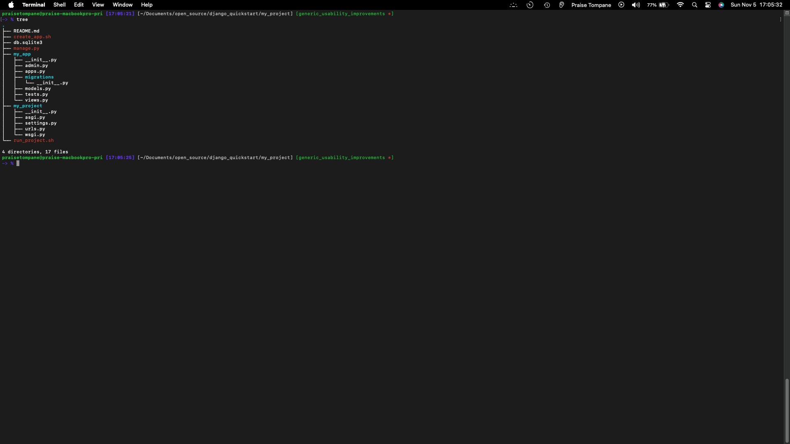
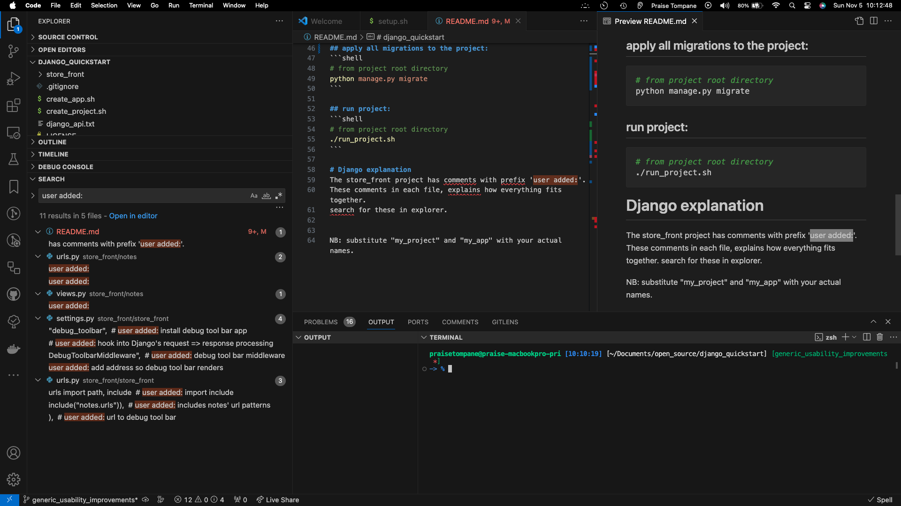

# django_quickstart
a utility to to quickly setup a Django project and app(s) so you can focus on creating your specific unique features.

## setup instructions:
1. install `python 3.11` or higher.
    - Python download: https://www.python.org/downloads/

2. clone repo:
    ```shell
    git clone git@github.com:praisetompane/django_quickstart.git
    ```
## package management:
- install pipenv: https://pypi.org/project/pipenv/

## install Django
```shell
# from django_quickstart root directory
./setup.sh
```
## activate a shell within virtual environment
```shell
# from django_quickstart root directory
pipenv shell
```

# usage
**NB**: substitute "my_project" and "my_app" with your actual names.

## create project:
```shell
# from django_quickstart root directory
./create_project.sh my_project
```
* this creates does the following:
   * a Django project folder called my_project.
   * installs two scripts:
      - create_app.sh : a shorthand to create a Django app for your project
      - run_project.sh : a shorthand to run your Django project

## create app:
* move to project root folder:
    ```shell
    # from django_quickstart root directory
    cd my_project
    ```
* create app(s):
    ```shell
    # from my_project root directory
    ./create_app.sh my_app
    ```

* apply all migrations to the project:
    ```shell
    # from my_project root directory
    python manage.py migrate
    ```
* project state after this:


## run project:
```shell
# from my_project root directory
./run_project.sh 
```

# Django explanation
The `store_front` project and `notes` app have comments with prefix 'user added:'. <br>
These comments explain how everything fits together. <br>
Search for these in explorer. <br>
example: <br>


